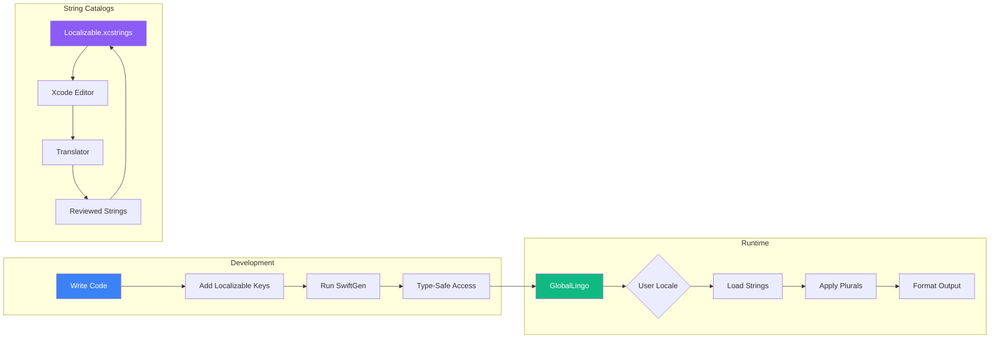

# GlobalLingo

```
   ██████╗ ██╗      ██████╗ ██████╗  █████╗ ██╗     
  ██╔════╝ ██║     ██╔═══██╗██╔══██╗██╔══██╗██║     
  ██║  ███╗██║     ██║   ██║██████╔╝███████║██║     
  ██║   ██║██║     ██║   ██║██╔══██╗██╔══██║██║     
  ╚██████╔╝███████╗╚██████╔╝██████╔╝██║  ██║███████╗
   ╚═════╝ ╚══════╝ ╚═════╝ ╚═════╝ ╚═╝  ╚═╝╚══════╝
                                                     
  ██╗     ██╗███╗   ██╗ ██████╗  ██████╗             
  ██║     ██║████╗  ██║██╔════╝ ██╔═══██╗            
  ██║     ██║██╔██╗ ██║██║  ███╗██║   ██║            
  ██║     ██║██║╚██╗██║██║   ██║██║   ██║            
  ███████╗██║██║ ╚████║╚██████╔╝╚██████╔╝            
  ╚══════╝╚═╝╚═╝  ╚═══╝ ╚═════╝  ╚═════╝             
                                                     
        🌍 Type-Safe Localization for Swift          
```

<div align="center">

[](https://swift.org)
[](https://github.com/muhittincamdali/GlobalLingo/actions)[]()
[](https://github.com/muhittincamdali/GlobalLingo/actions)[](https://swift.org/package-manager/)
[](https://github.com/muhittincamdali/GlobalLingo/actions)[](LICENSE)
[](https://github.com/muhittincamdali/GlobalLingo/actions)[]()
[](https://github.com/muhittincamdali/GlobalLingo/actions)
**Modern localization toolkit with String Catalogs, pluralization, and SwiftGen support.**

[Installation](#installation) • [Quick Start](#quick-start) • [String Catalogs](#string-catalogs) • [Pluralization](#pluralization) • [SwiftGen](#swiftgen-integration)

</div>

---

## Why GlobalLingo?

- **Type-Safe Strings** — Compile-time checks, no more typos in localization keys
- **String Catalogs** — Native Xcode 15+ `.xcstrings` support
- **Smart Pluralization** — Handles one/few/many/other for 100+ languages
- **RTL Ready** — Built-in right-to-left layout support
- **SwiftGen Compatible** — Generate strongly-typed accessors
- **Zero Dependencies** — Pure Swift, lightweight footprint

---

## Supported Languages

| Language | Code | Pluralization | RTL | String Catalog |
|----------|:----:|:-------------:|:---:|:--------------:|
| English | `en` | ✅ | — | ✅ |
| Spanish | `es` | ✅ | — | ✅ |
| French | `fr` | ✅ | — | ✅ |
| German | `de` | ✅ | — | ✅ |
| Italian | `it` | ✅ | — | ✅ |
| Portuguese | `pt` | ✅ | — | ✅ |
| Russian | `ru` | ✅ | — | ✅ |
| Chinese (Simplified) | `zh-Hans` | ✅ | — | ✅ |
| Chinese (Traditional) | `zh-Hant` | ✅ | — | ✅ |
| Japanese | `ja` | ✅ | — | ✅ |
| Korean | `ko` | ✅ | — | ✅ |
| Arabic | `ar` | ✅ | ✅ | ✅ |
| Hebrew | `he` | ✅ | ✅ | ✅ |
| Turkish | `tr` | ✅ | — | ✅ |
| Dutch | `nl` | ✅ | — | ✅ |
| Polish | `pl` | ✅ | — | ✅ |
| Hindi | `hi` | ✅ | — | ✅ |
| Thai | `th` | ✅ | — | ✅ |
| Vietnamese | `vi` | ✅ | — | ✅ |
| Indonesian | `id` | ✅ | — | ✅ |

> 💡 Full list includes 100+ languages with CLDR-compliant plural rules.

---

## Localization Workflow



---

## Installation

### Swift Package Manager

```swift
dependencies: [
    .package(url: "https://github.com/muhittincamdali/GlobalLingo.git", from: "2.0.0")
]
```

### CocoaPods

```ruby
pod 'GlobalLingo', '~> 2.0'
```

---

## Quick Start

```swift
import GlobalLingo

// Initialize with your bundle
let lingo = GlobalLingo(bundle: .main)

// Simple translation
let greeting = lingo.localized("hello_world")
// → "Hello, World!" (en)
// → "Hola, Mundo!" (es)
// → "Bonjour, le Monde!" (fr)

// With arguments
let welcome = lingo.localized("welcome_user", arguments: ["Muhittin"])
// → "Welcome, Muhittin!"
```

---

## String Catalogs

GlobalLingo works seamlessly with Xcode 15+ String Catalogs (`.xcstrings`).

### Creating a String Catalog

1. **File → New → File → String Catalog**
2. Name it `Localizable.xcstrings`
3. Add your languages in the inspector

### Catalog Structure

```json
{
  "sourceLanguage": "en",
  "strings": {
    "welcome_message": {
      "localizations": {
        "en": { "stringUnit": { "value": "Welcome to GlobalLingo!" } },
        "es": { "stringUnit": { "value": "¡Bienvenido a GlobalLingo!" } },
        "de": { "stringUnit": { "value": "Willkommen bei GlobalLingo!" } }
      }
    }
  }
}
```

### Accessing Catalog Strings

```swift
// Direct access
let message = String(localized: "welcome_message")

// With GlobalLingo formatting
let formatted = lingo.localized("greeting_time", arguments: [userName, timeOfDay])
```

---

## Pluralization

Handle singular/plural forms correctly across all languages.

### Defining Plural Rules

```swift
// In your String Catalog or .stringsdict
"items_count" = {
    "one" = "%d item";
    "other" = "%d items";
};

// Russian has more complex rules
"items_count" = {
    "one" = "%d товар";       // 1, 21, 31...
    "few" = "%d товара";      // 2-4, 22-24...
    "many" = "%d товаров";    // 5-20, 25-30...
    "other" = "%d товаров";
};
```

### Using Plural Strings

```swift
let itemCount = 5

// Automatic plural selection based on count
let text = lingo.pluralized("items_count", count: itemCount)
// English: "5 items"
// Russian: "5 товаров"
// Arabic:  "٥ عناصر"
```

### String Catalog Pluralization

```json
{
  "files_count": {
    "localizations": {
      "en": {
        "variations": {
          "plural": {
            "one": { "stringUnit": { "value": "%lld file" } },
            "other": { "stringUnit": { "value": "%lld files" } }
          }
        }
      },
      "pl": {
        "variations": {
          "plural": {
            "one": { "stringUnit": { "value": "%lld plik" } },
            "few": { "stringUnit": { "value": "%lld pliki" } },
            "many": { "stringUnit": { "value": "%lld plików" } },
            "other": { "stringUnit": { "value": "%lld plików" } }
          }
        }
      }
    }
  }
}
```

---

## Formatting

Locale-aware formatting for dates, numbers, and currencies.

### Number Formatting

```swift
let number = 1234567.89

lingo.formatNumber(number, locale: "en_US")  // → "1,234,567.89"
lingo.formatNumber(number, locale: "de_DE")  // → "1.234.567,89"
lingo.formatNumber(number, locale: "fr_FR")  // → "1 234 567,89"
```

### Currency Formatting

```swift
let price = 99.99

lingo.formatCurrency(price, code: "USD", locale: "en_US")  // → "$99.99"
lingo.formatCurrency(price, code: "EUR", locale: "de_DE")  // → "99,99 €"
lingo.formatCurrency(price, code: "JPY", locale: "ja_JP")  // → "¥100"
```

### Date Formatting

```swift
let date = Date()

lingo.formatDate(date, style: .medium, locale: "en_US")  // → "Jan 15, 2025"
lingo.formatDate(date, style: .medium, locale: "de_DE")  // → "15. Jan. 2025"
lingo.formatDate(date, style: .medium, locale: "ja_JP")  // → "2025/01/15"
```

### Relative Date Formatting

```swift
let yesterday = Date().addingTimeInterval(-86400)

lingo.formatRelativeDate(yesterday, locale: "en")  // → "yesterday"
lingo.formatRelativeDate(yesterday, locale: "es")  // → "ayer"
lingo.formatRelativeDate(yesterday, locale: "de")  // → "gestern"
```

---

## SwiftGen Integration

Generate type-safe string accessors with SwiftGen.

### Installation

```bash
brew install swiftgen
```

### Configuration

Create `swiftgen.yml` in your project root:

```yaml
strings:
  inputs:
    - Resources/Localizable.xcstrings
  outputs:
    - templateName: structured-swift5
      output: Generated/Strings.swift
      params:
        enumName: L10n
        publicAccess: true
```

### Generate

```bash
swiftgen
```

### Generated Code

```swift
// Generated/Strings.swift
enum L10n {
    /// Welcome to GlobalLingo!
    static let welcomeMessage = L10n.tr("welcome_message")
    
    /// Hello, %@!
    static func greetingName(_ p1: String) -> String {
        L10n.tr("greeting_name", p1)
    }
    
    /// %d items
    static func itemsCount(_ p1: Int) -> String {
        L10n.tr("items_count", p1)
    }
}
```

### Usage with SwiftGen

```swift
// Type-safe, autocomplete-friendly
let welcome = L10n.welcomeMessage
let greeting = L10n.greetingName("Muhittin")
let items = L10n.itemsCount(42)
```

---

## SwiftUI Integration

```swift
import SwiftUI
import GlobalLingo

struct ContentView: View {
    @Environment(\.locale) var locale
    
    var body: some View {
        VStack(spacing: 20) {
            // Using String Catalogs directly
            Text("welcome_message")
            
            // With interpolation
            Text("Hello, \(userName)!")
            
            // Pluralization
            Text("files_count \(fileCount)")
        }
    }
}

// Custom modifier for dynamic locale switching
struct LocaleModifier: ViewModifier {
    let locale: Locale
    
    func body(content: Content) -> some View {
        content.environment(\.locale, locale)
    }
}
```

---

## RTL Support

GlobalLingo automatically handles right-to-left languages.

```swift
// Check if current locale is RTL
if lingo.isRightToLeft {
    // Adjust layout accordingly
}

// Force layout direction
view.semanticContentAttribute = lingo.isRightToLeft ? .forceRightToLeft : .forceLeftToRight
```

### SwiftUI RTL

```swift
struct RTLAwareView: View {
    @Environment(\.layoutDirection) var layoutDirection
    
    var body: some View {
        HStack {
            if layoutDirection == .rightToLeft {
                // RTL layout
            } else {
                // LTR layout
            }
        }
    }
}
```

---

## Configuration

```swift
let config = GlobalLingoConfiguration(
    defaultLanguage: "en",
    fallbackLanguage: "en",
    bundle: .main,
    tableName: "Localizable"
)

let lingo = GlobalLingo(configuration: config)
```

### Language Override

```swift
// Force specific language regardless of device settings
lingo.setLanguage("de")

// Reset to system language
lingo.resetToSystemLanguage()
```

---

## Best Practices

### Do's ✅

```swift
// Use descriptive keys
"button_submit_order"
"error_network_unavailable"
"settings_notifications_enabled"

// Include context in keys
"profile_edit_button"
"checkout_edit_button"

// Use String Catalogs for new projects
// Leverage SwiftGen for type safety
```

### Don'ts ❌

```swift
// Avoid generic keys
"button1"
"text"
"message"

// Don't concatenate localized strings
let bad = localized("hello") + " " + localized("world")

// Don't hardcode strings
Text("Welcome!")  // ❌
Text("welcome_message")  // ✅
```

---

## Project Structure

```
YourApp/
├── Resources/
│   ├── Localizable.xcstrings      # Main string catalog
│   ├── InfoPlist.xcstrings        # Info.plist strings
│   └── Localizable/               # Legacy .strings (optional)
│       ├── en.lproj/
│       ├── es.lproj/
│       └── de.lproj/
├── Generated/
│   └── Strings.swift              # SwiftGen output
└── swiftgen.yml                   # SwiftGen config
```

---

## Requirements

| Requirement | Version |
|------------|---------|
| Swift | 5.9+ |
| iOS | 15.0+ |
| macOS | 12.0+ |
| tvOS | 15.0+ |
| watchOS | 8.0+ |
| visionOS | 1.0+ |
| Xcode | 15.0+ |

---

## Contributing

1. Fork this repository
2. Create your feature branch (`git checkout -b feature/cool-stuff`)
3. Commit your changes (`git commit -m 'feat: add cool stuff'`)
4. Push to the branch (`git push origin feature/cool-stuff`)
5. Open a Pull Request

See [CONTRIBUTING.md](CONTRIBUTING.md) for detailed guidelines.

---

## License

MIT License — see [LICENSE](LICENSE) for details.

---

<div align="center">

**If this helps your project, give it a ⭐**

Made by [Muhittin Camdali](https://github.com/muhittincamdali)

</div>
